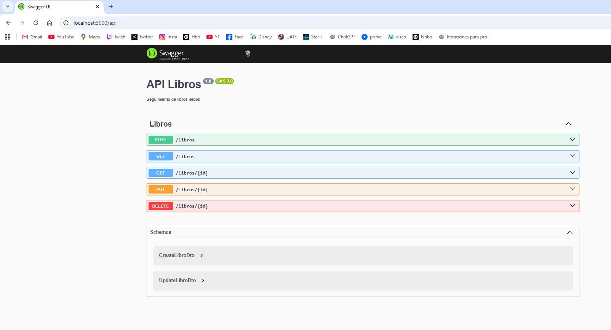
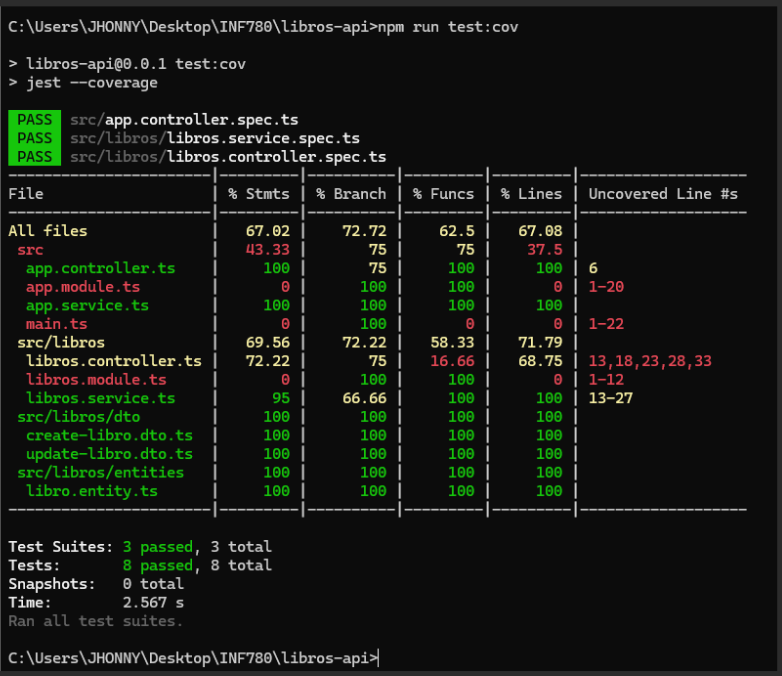

# API de Libros Leídos

## Descripción

API REST desarrollada con NestJS para gestionar libros leídos. Permite crear, listar, actualizar y eliminar libros.

---

## Instalación

npm install

---

## Ejecución

npm run start:dev

Servidor:
http://localhost:3000

---

## Swagger

http://localhost:3000/api

---

## Pruebas

npm run test

Cobertura:
npm run test:cov

---

## Capturas

### Swagger funcionando

### Coverage
